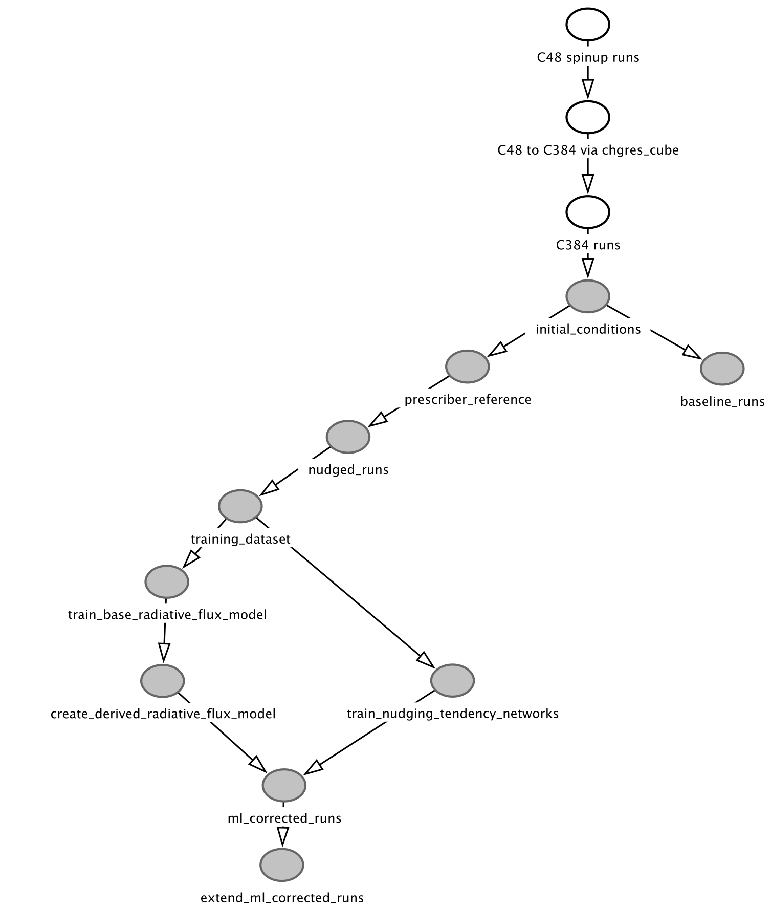

# nudge-to-fine-25km-manuscript-workflow

This repository contains the code used to configure and run the experiments, as
well as generate all the figures and tables for the nudge-to-fine-25km
manuscript.  This is a follow-up paper to [Bretherton et al.
(2022)](https://agupubs.onlinelibrary.wiley.com/doi/10.1029/2021MS002794),
hereafter "B22," which applies the method described there in multi-year
simulations and in multiple climates.

The spinup and fine-resolution simulations described in the paper were each run
on NOAA's Gaea computer, while the other components of this workflow -- nudged
runs, baseline runs, ML-model-training, ML-corrected runs, and
post-processing/figure creation -- were run on Google Cloud, either on a cluster
through the use of Argo workflows or locally on a virtual machine.

## Workflow

The workflow for reproducing the experiments described in the paper is
summarized in the directed acyclic graph below.  In all cases where "runs" are
referenced, simulations in all four climates are completed, i.e. climates with
sea-surface temperatures perturbed by -4 K, 0 K, +4 K, and +8 K.

The white nodes in this graph are all steps that were completed on Gaea; the
gray nodes are steps that were completed on Google Cloud infrastructure.  The
`Makefile` in this repository corresponds to steps that were completed on Google
Cloud; the labels of the nodes correspond to the names of `make` rules in the
`Makefile`.  While a `Makefile` is not included for the simulations completed on
Gaea, all configurations and example runscripts are provided for reference, as
well as a link to the version of FV3GFS used in those runs.

### Generating the fine-resolution data (Gaea)

To generate a fine-resolution dataset to use both as a target for nudging and
validation for ML-corrected simulations, we start by running one-year spinup
simulations at coarse resolution (C48) using FV3GFS in each climate.  These
simulations are started from GFS anaylsis initial conditions for the time
2016-08-01 00Z, with the SST perturbed by the corresponding amount depending on
the climate.  After one year, the C48 resolution restart files at the end of
each spinup run are transformed to a resolution of C384 using the `chgres_cube`
tool to serve as initial conditions for two-year C384 resolution simulations
using the same model.  In the two-year C384 simulations, to enable a high output
frequency while limiting the storage footprint, diagnostics and intermediate
restart files are written out at C48 resolution using an online coarse-graining
process described in B22.

The configurations as well as sample scripts for running
the `chgres_cube` tool and running these simulations can be found in the
`workflows/fine-resolution-runs` directory.  

### Generating training data for machine learning (Google Cloud)

To generate training data, we make use of the output produced by the C384
simulations run on Gaea.  We start by running C48 resolution simulations nudged
to the coarsened state of the C384 resolution model, which we output every
fifteen minutes in the form of intermediate restart files from the C384 runs. In
addition to nudging several atmosphere fields, we also prescribe values seen by
the land surface; these fields come from the diagnostics produced by the
fine-resolution runs.

Before running these simulations, we start by patching the maximum snow albedo
field in the individual sets of coarsened restart files we use as initial
conditions in subsequent coarse-resolution simulations.  A flaw in the
coarse-graining method used for this particular field led to biases in
coarse-resolution simulations.  Then to enable prescribing fields to the land
surface, we must first generate a "prescriber dataset" which our Python-wrapped
version of the model can read as it runs.  These two steps are accomplished for
each climate by the `initial_conditions` and `prescriber_reference` Makefile
rules.  Once those two steps are complete, the nudged simulations can be
submitted using the `nudged_runs` rule.

### Training machine learning models (Google Cloud)

To train machine learning models, we first construct a zarr store that combines
subsampled output -- 160 snapshots from the first years and 90 snapshots from
the second years -- from the nudged and fine-resolution simulations from each
climate together in a cohesive dataset with a "dataset" dimension.  The first
160 snapshots are used for training, while the remaining 90 snapshots are used
for testing.  This dataset is constructed using the `training_dataset` rule.  

Once the training dataset is created, the machine learning models can be
trained.  We start by training a random forest to predict the shortwave
transmissivity of the atmosphere and the downward longwave radiative flux at the
surface using the `train_base_radiative_flux_model` rule.  Then we can construct
the derived model, which is built to leverage the prediction of the shortwave
transmissivity and the internal state of FV3GFS to predict the downward and net
shortwave radiative fluxes at the surface.  This derived model is built using
the `create_derived_radiative_flux_model` rule.

In addition to predicting radiative fluxes, we also predict the temperature and
specific humidity nudging tendencies.  To do this we use neural networks, and we
start by training four with different random seeds.  This is done using the
`train_nudging_tendency_networks` rule.

### Running baseline and machine-learning-corrected simulations (Google Cloud)

With the ML models trained, we can move on to running the baseline and
ML-corrected runs.  The baseline simulations are run using the `baseline_runs`
rule.  The ML-corrected runs are first started with each of the neural networks
trained with the four random seeds and are run for 15 months in each climate.
Then, based on performance in the first 15 months, the simulations with the seed
2 nudging tendency neural network are extended out to 63 months.  In each of the
ML-corrected runs the same radiative flux derived model is used.

### Generating figures (Google Cloud)

Finally, to generate the figures and tables in the manuscript, we start by
running a set of post-processing scripts that do some post-processing and
combine data from all the simulations in an easy to read form.  This is done in
the `post_process_runs` rule.  After that, the figures and tables used in the
paper can be generated using the `create_figures` rule, which runs the
interactive notebooks that contain the code to produce them.
